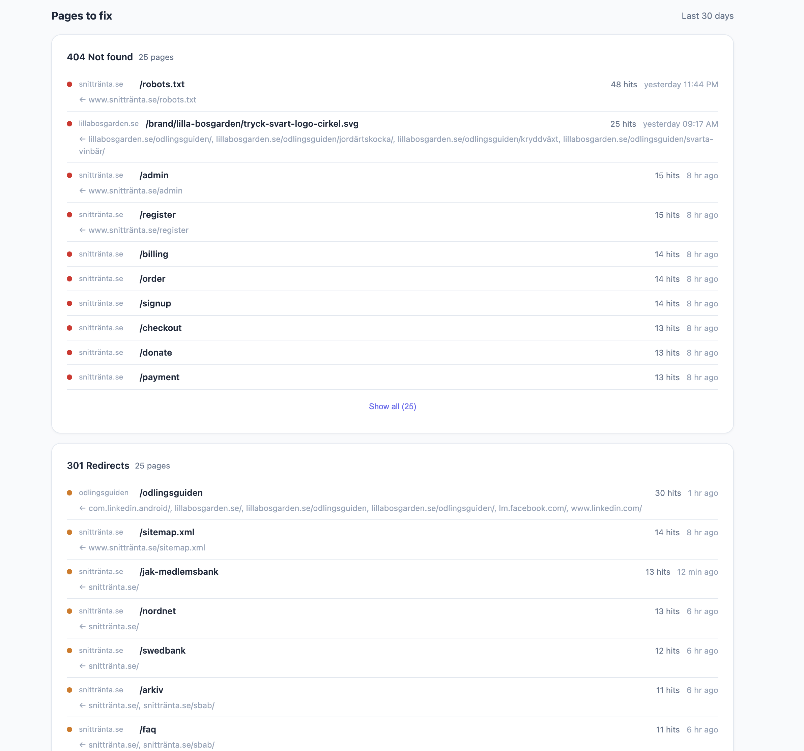

# Puls

[](https://github.com/webready-se/puls/actions/workflows/tests.yml)
[](LICENSE)

**One file. No cookies. Full picture.**

See your traffic. Respect their privacy.

Puls is a cookieless, lightweight analytics tool built with a single PHP file and SQLite. No frameworks, no dependencies, no build step. Drop it on any PHP host and go.


## Features

- **Cookieless** — GDPR-friendly by default, no consent banners needed
- **Lightweight** — ~15KB tracking script, single PHP file backend
- **Multi-site hub** — Track all your sites from one dashboard
- **Bot detection** — Separates real visitors from bots (AI crawlers, search engines, social, SEO tools)
- **Privacy-first** — Daily-rotating visitor hashes, no PII stored
- **Multi-user** — Bcrypt auth with per-user site access control
- **Zero dependencies** — PHP 8.2+ and SQLite, nothing else

<details>
<summary>Bot detection & broken link tracking</summary>




</details>

## Quick Start

```bash
# 1. Clone
git clone git@github.com:webready-se/puls.git
cd puls

# 2. Setup
php puls key:generate
php puls user:add admin

# 3. Install dev dependencies (also activates pre-push test hook)
composer install

# 4. Run locally
php -S localhost:8080 -t public
```

## Add Tracking

```html
<script src="https://your-puls-domain/?js" data-site="my-site" defer></script>
```

Works with Next.js, Astro, Laravel, Statamic, React, static HTML, and anything else that serves HTML. See [docs/integrations.md](docs/integrations.md) for framework examples, bot tracking pixel, server-side Nginx mirror, and reverse proxy setup.

## CLI

All management goes through `php puls`:

```bash
php puls key:generate                    # Generate APP_KEY + create .env
php puls user:add <name>                 # Add user with full access
php puls user:add <name> --sites=a,b     # Add user restricted to specific sites
php puls user:edit <name>                # Edit user (sites, password)
php puls user:remove <name>              # Remove a user
php puls user:list                       # List all users
php puls sites:list                      # List all tracked sites
php puls sites:rename <old> <new>        # Rename a tracked site
```

Users with no `--sites` flag can see all sites. Restricted users only see their assigned sites.

## Configuration

All configuration lives in `.env` (created by `php puls key:generate` from `.env.example`):

```env
APP_KEY=base64:...          # Auto-generated, used for visitor hashing
ALLOWED_ORIGINS=            # CORS: comma-separated origins
DB_PATH=data/puls.sqlite    # Database path (relative to project root)
SESSION_LIFETIME=2592000    # 30 days
MAX_LOGIN_ATTEMPTS=5
LOCKOUT_MINUTES=15
```

### CORS

If tracking scripts are loaded cross-origin, add the origins to `ALLOWED_ORIGINS` in `.env` (comma-separated):

```env
ALLOWED_ORIGINS=https://example.com,https://another-site.com
```

## Deployment

### Requirements

- PHP 8.2+
- `pdo_sqlite` extension (included in most PHP installations)
- Write access to `data/` directory

### Nginx

```nginx
server {
    listen 443 ssl http2;
    server_name puls.example.com;
    root /var/www/puls/public;
    index index.php;

    location / {
        try_files $uri /index.php$is_args$args;
    }

    location ~ \.php$ {
        fastcgi_pass unix:/var/run/php/php8.3-fpm.sock;
        fastcgi_param SCRIPT_FILENAME $document_root$fastcgi_script_name;
        include fastcgi_params;
    }
}
```

### Apache

Add a `.htaccess` file in the `public/` directory:

```apache
RewriteEngine On
RewriteCond %{REQUEST_FILENAME} !-f
RewriteRule ^ index.php [L,QSA]
```

Make sure `mod_rewrite` is enabled (`a2enmod rewrite`) and that your virtual host allows overrides:

```apache
<Directory /var/www/puls/public>
    AllowOverride All
</Directory>
```

> **Note:** Server-side bot tracking (Nginx mirror) is not available on Apache. Use the `<noscript>` tracking pixel instead — see [docs/integrations.md](docs/integrations.md).

### Laravel Forge (zero-downtime deploys)

Puls auto-detects Forge's release directory structure and stores
`data/` and `users.json` in the site root automatically. No symlinks needed.

**First-time setup (SSH):**

```bash
cd /home/forge/puls.example.com/current
php puls key:generate
php puls user:add admin
```

**Deploy script (default is fine):**

```bash
$CREATE_RELEASE()

cd $FORGE_RELEASE_DIRECTORY

$ACTIVATE_RELEASE()
```

### Shared Hosting

1. Upload all files via FTP/SSH
2. Point the domain to the `public/` directory
3. Run `php puls key:generate && php puls user:add admin` via SSH
4. Done

## Data Collected

**Pageviews:** path, referrer domain, browser, device type, daily visitor hash, UTM params (source, medium, campaign, term, content), language

**Bots:** path, bot name, category (AI, Search engine, Social, SEO, Monitor), user agent

**Not collected:** IP addresses, cookies, personal data, fingerprints

## License

MIT
