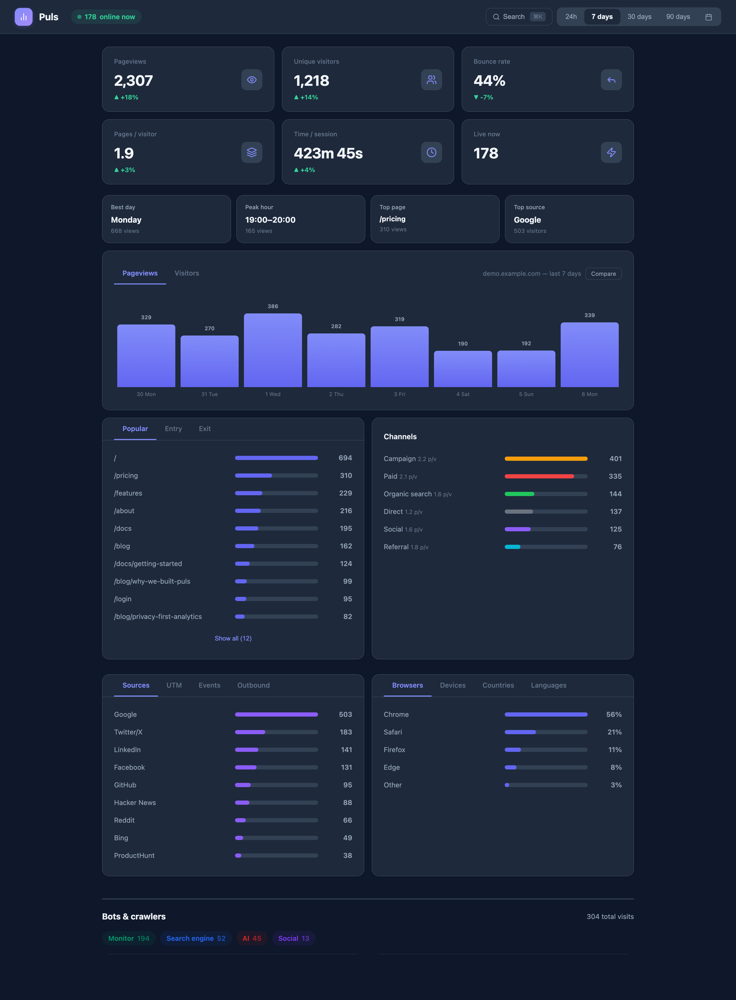
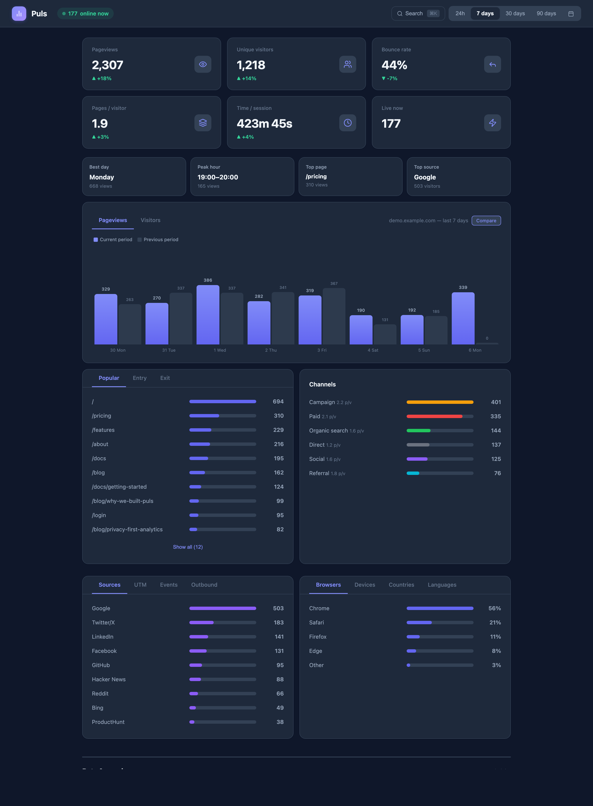
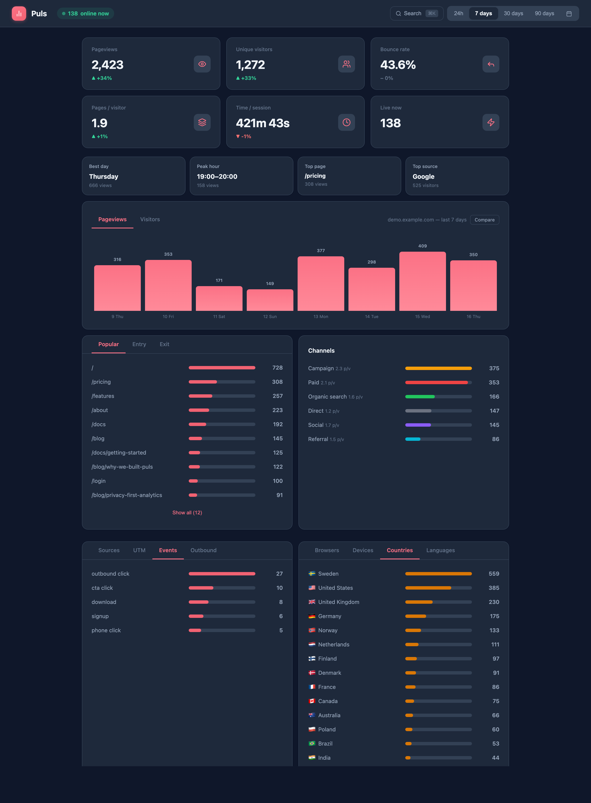
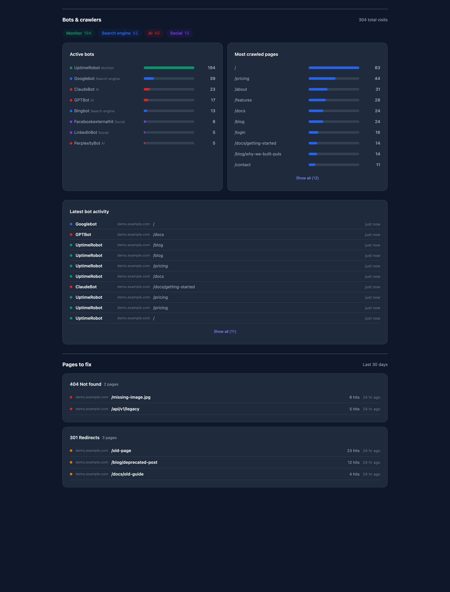
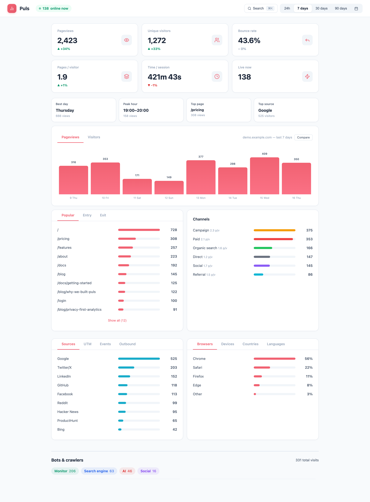

# Puls

[](https://github.com/webready-se/puls/actions/workflows/tests.yml)
[](LICENSE)

**One file. No cookies. Full picture.**

See your traffic. Respect their privacy.

Puls is a cookieless, lightweight analytics tool built with a single PHP file and SQLite. No frameworks, no dependencies, no build step. Drop it on any PHP host and go.



## Why Puls?

Most analytics tools are either privacy-invasive (Google Analytics) or require Docker, Node.js, or managed hosting (Plausible, Umami). Fathom is great but costs $15+/month.

Puls is **one PHP file**. Upload it, run `php puls key:generate`, and you're live. No containers, no queues, no external databases. SQLite handles everything. Perfect for freelancers, agencies, and anyone who wants analytics without infrastructure.

## Privacy

Puls is designed to be GDPR-friendly without consent banners:

- **No cookies** — ever
- **No IP storage** — visitor hashes rotate daily and use a server-side salt
- **No fingerprinting** — no canvas, font, or WebGL tricks
- **No PII** — no names, emails, or identifiers stored
- **Data collected:** page path, referrer domain, browser, device type, UTM params, language, country (from Accept-Language header)
- **Not collected:** IP addresses, cookies, personal data, fingerprints

## Features

**Core**
- **Cookieless** — GDPR-friendly by default, no consent banners needed
- **Lightweight** — ~1.5KB tracking script, single PHP file backend
- **Zero dependencies** — PHP 8.2+ and SQLite, nothing else

**Dashboard**
- **Multi-site hub** — track all your sites from one dashboard with site overview
- **Traffic channels** — Paid, Campaign, Organic, Social, Referral, Direct with click filtering
- **Country stats** — visitor countries from Accept-Language with flag emojis
- **Custom date range** — 24h, 7d, 30d, 90d, or pick any from/to dates
- **Goals/conversions** — set target pages and track conversion rate
- **Trend indicators** — comparison with previous period (▲12%)
- **Bounce rate & session length** — median session duration, inverted bounce trend
- **Entry/exit pages** — see where visitors land and leave
- **Summary insights** — best day, peak hour, top page, top source
- **Realtime** — "N online now" badge (last 5 min)
- **Dark mode** — System/Dark/Light theme
- **CMD+K** — command palette with page search and filtering
- **PWA** — installable, pull-to-refresh

**Tracking**
- **Custom events** — `puls.track('signup', { plan: 'pro' })` JS API
- **Auto events** — zero-config tracking of phone clicks, email clicks, downloads, form submissions
- **Outbound links** — auto-track clicks on external links
- **UTM campaigns** — full UTM support with guided link wizard
- **Google Ads** — auto-detect `gad_source`/`gad_campaignid` (JS + server-side)

**Bot & link monitoring**
- **Bot detection** — 25+ bots: AI crawlers, search engines, social, SEO, monitors
- **Server-side bot tracking** — Nginx mirror for zero-latency capture
- **Broken link tracking** — 404/301 via Nginx post_action with referrer info

**Sharing & access**
- **Multi-user** — bcrypt auth with per-user site access control
- **Shareable dashboards** — token-based read-only links
- **Data export** — CSV/JSON download from the dashboard
- **Interactive CLI** — all management commands with pickers and prompts

<details>
<summary>More screenshots</summary>

**Compare with previous period**



**Events & country stats**



**Bot detection & broken link tracking**



**Light mode**



</details>

## Quick Start

### Docker

```bash
docker run -p 8080:8080 -e ADMIN_PASSWORD=changeme -v puls-data:/app/data puls
```

Or with Docker Compose:

```bash
curl -O https://raw.githubusercontent.com/webready-se/puls/main/docker-compose.yml
docker compose up
```

Open `http://localhost:8080` and log in with `admin` / your password.

### Download

Grab the [latest release](https://github.com/webready-se/puls/releases/latest) and extract:

```bash
unzip puls-*.zip
cd puls-*
php puls key:generate
php puls user:add admin
php -S localhost:8080 -t public
```

### Clone (for development)

```bash
git clone git@github.com:webready-se/puls.git
cd puls
php puls key:generate
php puls user:add admin
composer install        # dev dependencies + pre-push test hook
php -S localhost:8080 -t public
```

## Add Tracking

```html
<script src="https://your-puls-domain/?js" data-site="my-site" data-outbound defer></script>
```

This tracks pageviews and outbound link clicks automatically. Works with Next.js, Astro, Laravel, Statamic, React, static HTML, and anything else that serves HTML.

| Attribute | Required | Description |
|-----------|----------|-------------|
| `data-site` | Yes | Site name used to separate data in multi-site setups |
| `data-outbound` | No | Auto-track clicks on external links |
| `data-auto-events` | No | Auto-track phone clicks, email clicks, downloads, form submissions |
| `defer` | Recommended | Load script without blocking page render |

### Custom Events

```javascript
puls.track('signup', { plan: 'pro' });
puls.track('download', { file: 'brochure.pdf' });
```

Full documentation in [docs/integrations.md](docs/integrations.md):

- Framework examples (Next.js, Astro, Laravel, Statamic, React)
- Custom events API and auto event tracking
- Outbound link tracking
- Bot tracking pixel (`<noscript>`)
- Server-side bot tracking (Nginx mirror)
- Reverse proxy setup and rate limiting

## CLI

All management goes through `php puls`:

```bash
php puls key:generate                    # Generate APP_KEY + create .env
php puls user:add <name>                 # Add user with full access
php puls user:add <name> --sites=a,b     # Add user restricted to specific sites
php puls user:edit <name>                # Edit user (sites, password)
php puls user:remove <name>              # Remove a user
php puls user:list                       # List all users
php puls sites:list                      # List all tracked sites
php puls sites:rename <old> <new>        # Rename a tracked site
php puls share:create <site>             # Create a shareable dashboard link
php puls share:create <site> --label="Client Q1" --expires=2026-06-30
php puls share:list                      # List all share tokens
php puls share:revoke <token>            # Revoke a share token
php puls sites:remove <name>             # Delete all data for a site
php puls nginx:config                    # Generate Nginx config for a site
```

All commands work without arguments — interactive pickers and prompts guide you through.

## Configuration

All configuration lives in `.env` (created by `php puls key:generate` from `.env.example`):

```env
APP_KEY=base64:...          # Auto-generated, used for visitor hashing
APP_URL=https://puls.example.com  # Base URL (used in CLI for share links)
ALLOWED_ORIGINS=            # Allowed domains (comma-separated, includes subdomains)
DB_PATH=data/puls.sqlite    # Database path (relative to project root)
USERS_FILE=users.json       # User credentials path (relative to project root)
SESSION_LIFETIME=2592000    # 30 days
MAX_LOGIN_ATTEMPTS=5
LOCKOUT_MINUTES=15
IGNORED_BOTS=               # Bot UA patterns to exclude (comma-separated)
```

### Allowed Origins

To restrict which sites can send tracking data, add their domains to `ALLOWED_ORIGINS` in `.env`. Subdomains are included automatically:

```env
ALLOWED_ORIGINS=example.com,another-site.com
```

This allows tracking from `example.com`, `www.example.com`, `app.example.com`, etc. Leave empty to allow all origins.

### White-label

Customize branding via `.env`:

```env
APP_NAME=MyAnalytics
APP_TAGLINE=Your custom tagline
APP_ACCENT=#e11d48
```

This changes the login page, dashboard header, PWA manifest, and favicon. The footer always shows "Powered by Puls".

## Deployment

### Requirements

- PHP 8.2+
- `pdo_sqlite` extension (included in most PHP installations)
- Write access to `data/` directory

### Nginx

```nginx
server {
    listen 443 ssl http2;
    server_name puls.example.com;
    root /var/www/puls/public;
    index index.php;

    location / {
        try_files $uri /index.php$is_args$args;
    }

    location ~ \.php$ {
        fastcgi_pass unix:/var/run/php/php8.3-fpm.sock;
        fastcgi_param SCRIPT_FILENAME $document_root$fastcgi_script_name;
        include fastcgi_params;
    }
}
```

### Apache

Add a `.htaccess` file in the `public/` directory:

```apache
RewriteEngine On
RewriteCond %{REQUEST_FILENAME} !-f
RewriteRule ^ index.php [L,QSA]
```

Make sure `mod_rewrite` is enabled (`a2enmod rewrite`) and that your virtual host allows overrides:

```apache
<Directory /var/www/puls/public>
    AllowOverride All
</Directory>
```

> **Note:** Server-side bot tracking (Nginx mirror) is not available on Apache. Use the `<noscript>` tracking pixel instead — see [docs/integrations.md](docs/integrations.md).

### Laravel Forge (zero-downtime deploys)

Puls auto-detects Forge's release directory structure and stores
`data/` and `users.json` in the site root automatically. No symlinks needed.

**First-time setup (SSH):**

```bash
cd /home/forge/puls.example.com/current
php puls key:generate
php puls user:add admin
```

**Deploy script (default is fine):**

```bash
$CREATE_RELEASE()

cd $FORGE_RELEASE_DIRECTORY

$ACTIVATE_RELEASE()
```

### Shared Hosting

**With SSH access:**

1. Upload all files via FTP/SSH
2. Point the domain to the `public/` directory
3. Run `php puls key:generate && php puls user:add admin`
4. Done

**Without SSH access:**

1. Run `php puls key:generate && php puls user:add admin` locally
2. Upload all files including `.env` and `users.json` via FTP
3. Point the domain to the `public/` directory
4. Done

> **Important:** Keep `.env` and `users.json` in the project root — never place them inside `public/`. They contain your secret key and password hashes.

## License

MIT
